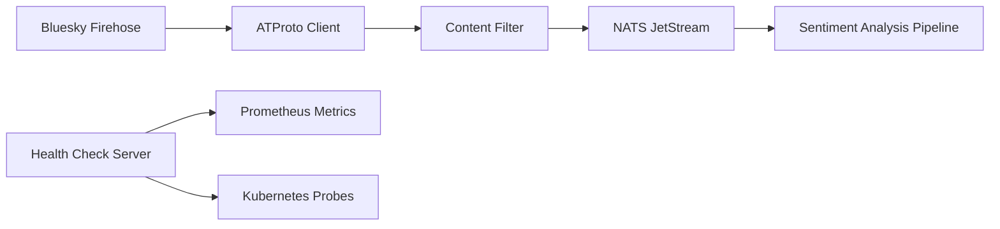

# NATS Firehose Ingest

A high-performance Python microservice for ingesting Bluesky firehose data into NATS JetStream for real-time sentiment analysis and processing. This service is part of a larger Kubernetes-based real-time sentiment analysis dashboard.

## 🚀 Quickstart

### Local Development (Docker)

```bash
# Start firehose ingest with docker compose watch for live reloading
docker compose watch
```

### Local Development (Python)

```bash
# uv is the recommended way to install dependencies
curl -LsSf https://astral.sh/uv/install.sh | sh

# Install dependencies and run
uv sync --frozen
source .venv/bin/activate
python main.py
```

### Kubernetes Deployment

```bash
# Clone the repository
git clone https://github.com/richardr1126/nats-firehose-ingest.git
cd nats-firehose-ingest

# Configure environment variables
cp charts/.env.example charts/.env
# Edit charts/.env with your NATS configuration

# Deploy to Kubernetes
cd charts
./create-secrets.sh
helm install nats-firehose-ingest ./nats-firehose-ingest
```

## 🚀 Features

- **Real-time Post Ingestion**: Connects to Bluesky's ATProto firehose for live post streaming (posts only)
- **NATS JetStream Integration**: Publishes filtered posts to NATS for durable, distributed messaging
- **Persistent Cursor State**: Uses NATS Key-Value store for cursor persistence across restarts
- **Intelligent Filtering**: Configurable post filtering based on content length, language, spam detection
- **High Performance**: Async Python implementation with batch processing and connection pooling
- **Production Ready**: Health checks, metrics, structured logging, and Kubernetes deployment
- **Containerized**: Docker image built with uv for fast, reproducible deployments
- **Observable**: Prometheus metrics, health endpoints, and detailed logging

## ⚙️ Configuration

Configure the service using environment variables:

### NATS Settings
- `NATS_URL`: NATS server URL (default: `nats://nats.nats.svc.cluster.local:4222`)
- `NATS_STREAM`: JetStream stream name (default: `bluesky-posts`)
- `NATS_SUBJECT`: Subject prefix for publishing (default: `bluesky.posts`)
- `NATS_KV_BUCKET`: Key-Value bucket for cursor persistence (default: `firehose-state`)

### Filtering Settings
- `ENABLE_TEXT_FILTERING`: Enable content filtering (default: `true`)
- `MIN_TEXT_LENGTH`: Minimum post length (default: `10`)
- `MAX_TEXT_LENGTH`: Maximum post length (default: `1000`)

### Monitoring Settings
- `HEALTH_CHECK_PORT`: Health check server port (default: `8080`)
- `LOG_LEVEL`: Logging level (default: `INFO`)
- `LOG_FORMAT`: Log format - `json` or `console` (default: `json`)

### Environment File Comparison (.env.example vs .env.prod)

| Variable | .env.example | .env.prod | Notes |
|----------|-------------|-----------|-------|
| `NATS_STREAM_NUM_REPLICAS` | `1` | `3` | Increased for HA in production |
| All others | Same as .env.prod | See .env.example | Same for dev and prod |

**Before deploying to Kubernetes**, ensure you have created and configured `.env.prod` in the service root directory. The `create-secrets.sh` script will fail if this file is missing.

## 🏗 Architecture



### Components

1. **ATProto Firehose Client**: Connects to Bluesky's real-time data stream (processes posts only, ignores deletions)
2. **Content Filter**: Filters posts based on length, language, and spam detection
3. **NATS JetStream Client**: Publishes filtered posts with acknowledgment and retry logic
4. **Health Check Server**: FastAPI server for health checks and metrics
5. **Structured Logging**: JSON logs with correlation IDs for observability

## 📊 Monitoring

### Health Endpoints

- `GET /health` - Basic health check
- `GET /health/detailed` - Detailed component status
- `GET /ready` - Kubernetes readiness probe
- `GET /metrics` - Prometheus metrics

### Key Metrics

- `nats_firehose_operations_total` - Total operations processed
- `nats_firehose_posts_published_total` - Posts successfully published
- `nats_firehose_publish_errors_total` - Total publish errors
- `firehose_messages_per_second` - Current message processing rate
- `nats_connected` - NATS connection status

### Example Metrics Output

```
# HELP nats_firehose_operations_total Total operations processed
# TYPE nats_firehose_operations_total counter
nats_firehose_operations_total 45231

# HELP firehose_messages_per_second Current firehose message rate
# TYPE firehose_messages_per_second gauge
firehose_messages_per_second 1247.3
```

## 🔧 Development

### Project Structure

```
nats-firehose-ingest/
├── src/
├── main.py                 # Entry point
├── Dockerfile              # Multi-stage Docker build
├── k8s-deployment.yaml     # Kubernetes manifests
├── pyproject.toml          # Dependencies and project config
└── README.md              # This file
```

### Adding New Filters

Extend the `PostFilter` class in `src/filters.py`:

```python
def _is_content_filtered(self, text: str) -> bool:
    # Add custom filtering logic here
    if 'your_custom_filter' in text.lower():
        return True
    return False
```

### Testing

```bash
# Install dev dependencies
uv add --dev pytest pytest-asyncio

# Run tests
uv run pytest
```

## 🚢 Deployment to GKE

This service integrates with the GKE cluster's NATS JetStream deployment:

1. **Ensure NATS is running**:
   ```bash
   kubectl get pods -n nats
   ```

2. **Deploy the service**:
   ```bash
   kubectl apply -f k8s-deployment.yaml
   ```

3. **Monitor deployment**:
   ```bash
   kubectl logs -f deployment/nats-firehose-ingest
   kubectl get svc nats-firehose-ingest
   ```

4. **Access metrics**:
   ```bash
   kubectl port-forward svc/nats-firehose-ingest 8080:8080
   curl http://localhost:8080/metrics
   ```

## 🎯 Performance

- **Throughput**: Processes 1000+ messages/second from Bluesky firehose
- **Latency**: <10ms processing time per message batch
- **Memory**: ~256MB typical usage, 512MB limit
- **CPU**: ~100m typical usage, 500m limit
- **Reliability**: Auto-restart on failures, health check monitoring

## 🔍 Troubleshooting

### Common Issues

1. **NATS Connection Failed**:
   ```bash
   kubectl exec -it deployment/nats-box -n nats -- nats server check
   ```

2. **Stream Not Found**:
   The service automatically creates the stream, but you can manually create it:
   ```bash
   kubectl exec -it deployment/nats-box -n nats -- nats stream add bluesky-posts
   ```

3. **High Memory Usage**:
   Reduce `BATCH_SIZE` and `BATCH_TIMEOUT_MS` for lower memory usage.

### Logs Analysis

```bash
# View structured logs
kubectl logs deployment/nats-firehose-ingest | jq .

# Filter for errors
kubectl logs deployment/nats-firehose-ingest | jq 'select(.level=="error")'

# Monitor real-time processing
kubectl logs -f deployment/nats-firehose-ingest | grep "Processing firehose"
```

### Design Notes

- **Deletion Operations**: This service intentionally ignores deletion operations from the firehose to focus solely on new post ingestion for real-time sentiment analysis
- **Performance Optimization**: By skipping deletions, the service achieves higher throughput and lower resource usage

## 🤝 Contributing

1. Fork the repository
2. Create a feature branch
3. Add tests for new functionality
4. Ensure all tests pass
5. Submit a pull request

## 📄 License

This project is part of a class assignment for datacenter computing.
